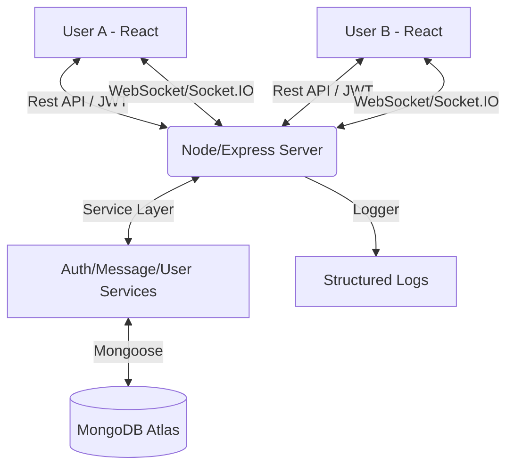

# 🚀 Enterprise Real-Time Chat App (MERN + Socket.IO)

A production-ready, high-performance chat application built with absolute focus on scalability, security, and premium user experience.

## 🌟 Key Features
- **Real-Time Communication**: Seamless one-to-one messaging via Socket.IO.
- **Enterprise Architecture**: Decoupled MVC with a dedicated **Service Layer** for business logic.
- **Glassmorphic UI**: Modern, premium design with Framer Motion animations and Tailwind CSS.
- **Optimistic UI Updates**: Messaging that feels instant, with data syncing in the background.
- **Advanced State Management**: Custom React Contexts for Authentication and Socket connectivity.
- **Robust Security**: JWT-based auth, secure password hashing (bcrypt), and standardized error handling.
- **Rich Interaction**: Typing indicators, online/offline status, and emoji support.

## 🛠 Tech Stack
- **Frontend**: React (Vite), Tailwind CSS, Framer Motion, Lucide React.
- **Backend**: Node.js, Express, Socket.IO.
- **Database**: MongoDB (Mongoose) with support for Atlas.
- **Logging**: Winston (Centralized structured logging).
- **Security**: JWT, Helmet, Express-Rate-Limit, CORS.

## 🏗 System Architecture

## 📈 Scalability & High-Level Architecture
For real-world production scaling, this application is designed to support:
- **Horizontal Scaling**: By integrating a **Redis Adapter**, the Socket.IO server can emit events across multiple server instances.
- **Database Integrity**: Proper indexing in MongoDB ensures snappy message retrieval even with millions of records.
- **Message Virtualization**: Ready to handle 10k+ messages per room using list virtualization.

## 🎓 Learning Outcomes
- **WebSockets vs HTTP**: Understood the difference between polling and full-duplex persistent connections.
- **Concurrency**: Managed real-time state synchronization across multiple clients.
- **Clean Code**: Implemented the "Controller -> Service -> Model" pattern ubiquitous in enterprise applications.

## 🚀 Getting Started
1. Clone the repository.
2. Setup `.env` in both `/backend` and `/frontend`.
3. `npm install` in both directories.
4. `npm run dev` to start the future of messaging.
